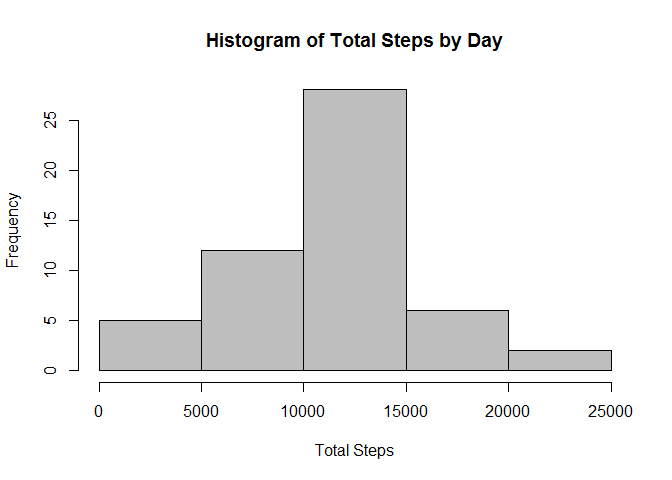
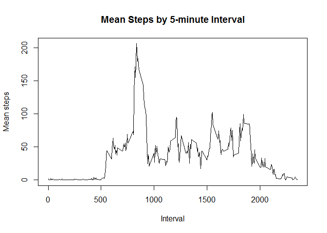
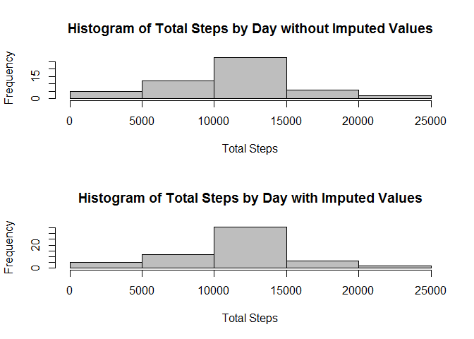
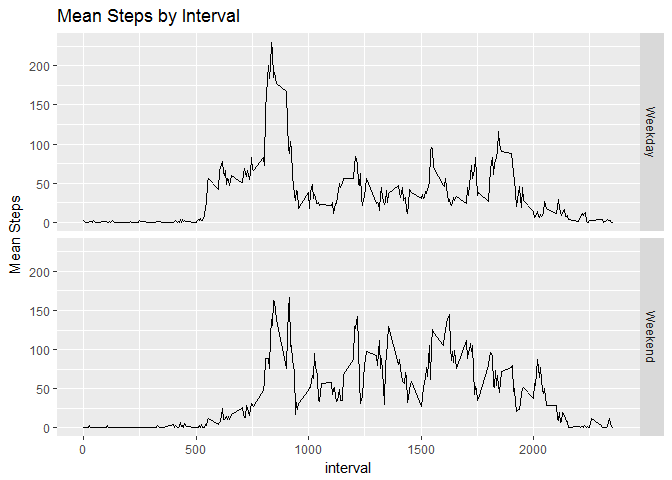

# Reproducible Research: Peer Assessment 1


##Loading and preprocessing the data
In this step we read in the original data, remove any missing entries, and convert the date field to a date class.

```r
require(dplyr)
require(ggplot2)

data <- read.csv("activity.csv")
data <- data[!(is.na(data$steps)),]
data$date <- as.Date(data$date)
```

##What is mean total number of steps taken per day?
Using the `dplyr` package, we group by date and sum the total number of steps per day. 

```r
totalSteps <- data %>% group_by(date) %>% summarize(total = sum(steps)) 
```

Next we create a histogram for the total number of steps taken each day.

```r
hist1 <- hist(totalSteps$total, col = 'gray', main="Histogram of Total Steps by Day", xlab = "Total Steps")
```

<!-- -->

The mean and median number of steps taken each day as given as:

```r
meanSteps <- mean(totalSteps$total)
meanSteps
```

```
## [1] 10766.19
```

```r
medianSteps <- median(totalSteps$total)
medianSteps
```

```
## [1] 10765
```


## What is the average daily activity pattern?

To answer this question, we create a time series plot of the 5-minute interval and mean number of steps taken per day.

```r
interval <- data %>% group_by(interval) %>% summarize(mean = mean(steps))
plot(x = interval$interval, y = interval$mean, type = "l", xlab = "Interval", ylab = "Mean steps", main = "Mean Steps by 5-minute Interval" )
```

<!-- -->

The 5-minute interval at 0835 on average has the maximum number or steps. This means that on average people are most active at approximately 8:35 a.m. This makes sense because this is likely the time that people are walking to work.

```r
maxInterval <- interval[interval$mean == max(interval$mean),]
maxInterval$interval
```

```
## [1] 835
```

## Imputing missing values
To calculuate the total number of missing values in the dataset, we use the `is.na` command.

```r
data <- read.csv("activity.csv")
stepsNA <- sum(is.na(data$steps))
data$date <- as.Date(data$date)
stepsNA
```

```
## [1] 2304
```

Next, we replace any missing values with the average number of steps for a particular 5-minute interval.

```r
intervalMean <- data[!(is.na(data$steps)),] %>% group_by(interval) %>% summarize(mean = mean(steps))
ImputData <- left_join(data,intervalMean, by="interval")
ImputData[is.na(ImputData$steps),1] <- ImputData[is.na(ImputData$steps),4]
```

The last step is to create a new dataset that is equal to the original dataset but with the missing data filled in.

```r
NewData <- data
NewData$steps <- ImputData$steps
```

Next, we compare the histogram of the total number of steps taken each day with the estimates from the first part of the assignment.

```r
NewtotalSteps <- NewData %>% group_by(date) %>% summarize(total = sum(steps)) 
par(mfrow=c(2,1))
hist(totalSteps$total, col = 'gray', main="Histogram of Total Steps by Day without Imputed Values", xlab = "Total Steps")
hist(NewtotalSteps$total, col = 'gray', main="Histogram of Total Steps by Day with Imputed Values", xlab = "Total Steps")
```

<!-- -->

The histograms have a negligible difference. Therefore, it does not appear that imputing missing data has a large effect.

This is further supported by examing the differnce between the mean and median total number of steps in comparison to the estimates from the first part of the assignment.


```r
NewmeanSteps <- mean(NewtotalSteps$total)
paste0("Initial estimate for mean: ",round(meanSteps,0),". Second estimate for mean: ", round(NewmeanSteps,0))
```

```
## [1] "Initial estimate for mean: 10766. Second estimate for mean: 10766"
```

```r
NewmedianSteps <- median(NewtotalSteps$total)
paste0("Initial estimate for median: ",round(medianSteps,0),". Second estimate for mean: ", round(NewmedianSteps,0))
```

```
## [1] "Initial estimate for median: 10765. Second estimate for mean: 10766"
```
Since the first and second estimates are almost identical, we can conclude that imputing values had a negligible effect. 

##Are there differences in activity patterns between weekdays and weekends?

First, we create a factor variable in the data set with two levels - "weekday" and "weekend" indicating whether a given date is a weekday or weekend day.

```r
NewData$dayofWeek <- weekdays(NewData$date)
NewData$wkend <- NewData$dayofWeek %in% c("Saturday", "Sunday")
NewData$wkend[NewData$wkend == TRUE] <- "Weekend"
NewData$wkend[NewData$wkend == FALSE] <- "Weekday"
```

Next, we make a panel plot containing a time series plot (i.e. type = "l") of the 5-minute interval (x-axis) and the average number of steps taken, averaged across all weekday days or weekend days (y-axis). 

```r
IntervalMean <- NewData %>% group_by(interval, wkend) %>% summarize(mean=mean(steps))

ggplot(IntervalMean, aes(x = interval, y=mean)) +
  geom_line() +
  facet_grid(wkend ~ .) +
  labs(title = "Mean Steps by Interval", x = "interval", y = "Mean Steps")
```

<!-- -->

From these plots we see that can see that people tend to be very active in the early morning around 8-9 a.m. on weekdays. However, weekdays tend to be less active over the remaining portion of the day in comparison to weekends. Likewise, people are generally sedendary during the later hours of the day (8 p.m.) on weekdays; whereas, people tend to be fairly active during these hours on the weekends.
